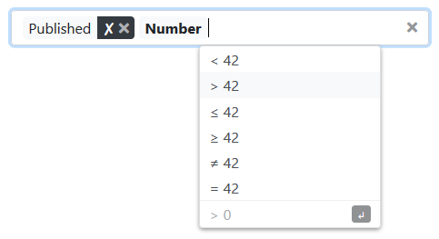

# Key Value Tag Input for Meteor and Bootstrap 4

Get reactive data in key-value form or as list of tags for your [Meteor](https://www.meteor.com/) application.
The input supports different data types with built-in input validation, generation of according mongo selectors for usage in search fields and filters, and makes it possible to specify suggestions for tag inputs.
The input element is styled for [Bootstrap 4](https://getbootstrap.com/) and behaves like any other `form-control`.



In standard mode, the user first types a key identifier (e.g. "published" in the screenshot example) followed by hitting a delimiter key (space, tab, enter, colon) and then types the value.
In single input mode, there is only one possible key and the user just keeps on producing values (e.g. tags).

## Usage

Install the package by running `meteor npm install --save meteor-bootstrap_key-value-tag-input`.

Both on client and server, import all your needed Classes and Types from the npm package `meteor-bootstrap_key-value-tag-input`.
In your client-side script, you also need to import the component files once:

```javascript
import "meteor-bootstrap_key-value-tag-input/dist/keyValueInput.html";
import "meteor-bootstrap_key-value-tag-input/dist/keyValueInput.css";
import "meteor-bootstrap_key-value-tag-input/dist/keyValueInput.js";
```

For your template, setup your types and the corresponding helpers and react to input changes in your event handling, e.g.:

```javascript
import { BooleanKeyValueType, NumberKeyValueType } from "meteor-bootstrap_key-value-tag-input";

const filterTypes = [
    new BooleanKeyValueType("published", "Published", [ "public" ]),
    new NumberKeyValueType("number", "Number", [ "value", "amount" ]),
];

Template.myTemplate.helpers({
    filterTypes() {
        return filterTypes;
    },
});

Template.myTemplate.events({
    "keyValueEntriesChanged .filterInput"(event) {
        // event.detail will contain all key value entries.
    },
});
```

In your template, setup the component:

```html
{{>keyValueInput types=filterTypes class="filterInput" }}
```

## Additional configuration

### Fallback types

If the input should forward all string input not matching a key to a dedicated KeyValueType, you can give the index of that fallback type to the input, e.g.:

```html
{{>keyValueInput types=filterTypes fallbackType=2 class="filterInput" }}
```

### Single mode

In order to just collect values for a single key, pass `kind="single"` to the input and pass a single KeyValueType to `type` (instead of an array to `types`).

### Default entries

Pass an array of `KeyValueEntryConstructionData` objects to `entries` to pre-fill the input.

Pass an array of `KeyValueEntryConstructionData` objects to `defaultEntries` in order to set some fixed entries (e.g. non-changable filter entries).

## Input Types

### General

All input types are subclasses of [`KeyValueType`](./src/keyValueTypes/KeyValueType.ts) and created using the same constructor signature:

```javascript
    constructor(id: string, label: string, aliases: string[] = [])
```

Each input type corresponds to an id (usually a key of the mongo object you want to work with), has a display label and possibly additional names it goes by.

Whenever the user changes the input, the form field fires a `keyValueEntriesChanged` event, which has an array of [`KeyValueEntry`](./src/keyValueTypes/KeyValueType.ts) as `detail` property.
Each entry consists of a reference to its `KeyValueType` (`type`) and the input `value`.

In order to clear an input, you can invoke `clearEntries(...)` on the `HTMLElement` of the input.

You can easily create your own input types by creating new subclasses of `KeyValueType`.

### Boolean

[`BooleanKeyValueType`](./src/keyValueTypes/BooleanKeyValueType.ts)s allow to select between `true` and `false`.
They accept a variety of values to be interpreted as boolean values, including true/false, yes/no, 1/0 and some german translations.
The value is rendered as ✓ or ✗.

### Date

[`DateKeyValueType`](./src/keyValueTypes/DateKeyValueType.ts)s are based on [Moment.js](https://momentjs.com/) and therefore require that library as peer dependency.

Date inputs by default accept inputs in the form of `YYYY-MM-DD`, `YY-MM-DD` or `MM-DD`.
The default output format is `YYYY-MM-DD`.
Both default settings can be configured by setting the `dateFormat` and the `dateParseFormats` respectively.
All date inputs come with a selected comparator (</>/≤/≥/≠/=).

Call the static method `mongoSelectorFor` with a value to get a mongo selector for the chosen comparator and date.

### Numbers

[`NumberKeyValueType`](./src/keyValueTypes/NumberKeyValueType.ts)s accept floating point values combined with a comparator.
You can configure the input delimiters by setting `delimiters`.
The value defaults to `{ decimal: ".", groups: "," }`.

For rendering, you can set `numberFormatter` to a [NumberFormat](https://developer.mozilla.org/en-US/docs/Web/JavaScript/Reference/Global_Objects/NumberFormat) of your choice.

Call the static method `mongoSelectorFor` with a value and an optional number transformation function to get a mongo selector for the chosen comparator and number.

[`NumberModifierKeyValueType`](./src/keyValueTypes/NumberKeyValueType.ts) works almost the same, except it does not ask for comparators, but for modifiers (=/*/÷/+/-) to be applied with `apply` on a number (possibly with some rounding).

### Regex / Text

[`RegexKeyValueType`](./src/keyValueTypes/RegexKeyValueType.ts)s support regular expressions, as minimongo supports it out of the box.

Call the static method `mongoSelectorFor` with a value to get a mongo selector for the input text.

### Sorting

[`SortKeyValueType`](./src/keyValueTypes/SortKeyValueType.ts)s are basically boolean inputs but distinguish between ascending and descending sorting for the given key.
You can get the corresponding mongo specifier by calling `mongoSpecifierFor` with a value.

### Tags

[`TagKeyValueType`](./src/keyValueTypes/TagKeyValueType.ts)s allow the user to either choose from a predefined set of tags or also input their own text.
Set `tags` to a string array of the predefined values and `allowOther` to a boolean specifying whether other strings are accepted or not.
